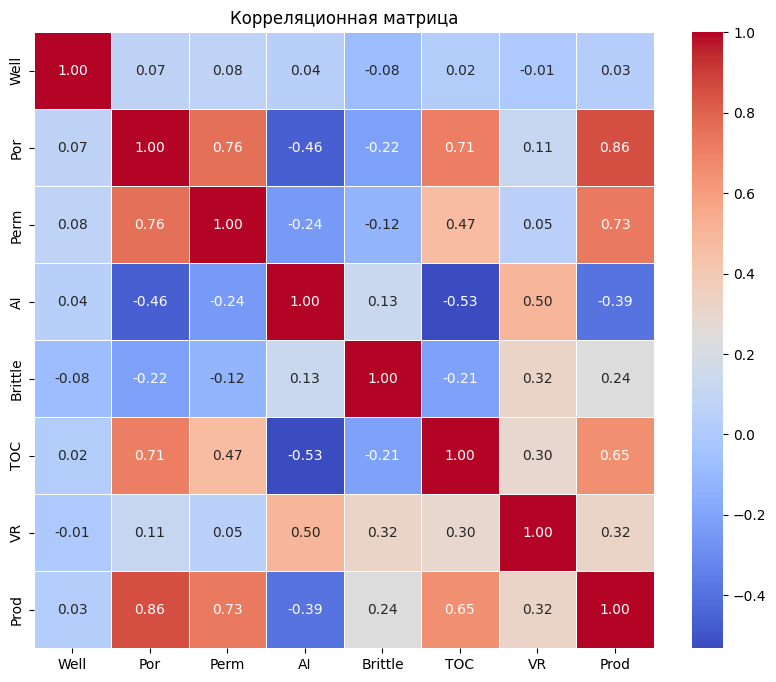
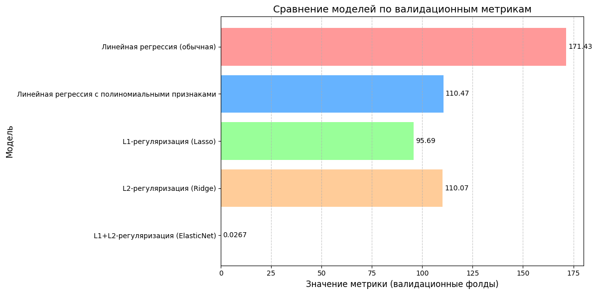

# MEPHI-Linear-Algebra
### Task 1: Oil and gas industry ( ML Model: Linear Regression. Ordinary Least Squares Method)
### Task 2: Real Estate Prices Prediction ( ML Model: Ordinary Least Squares Method)

#### Task 2  

# Прогнозирование выработки газа на скважинах

## Описание проекта
Этот проект направлен на создание модели для прогнозирования выработки газа на скважинах на основе различных факторов, таких как пористость, проницаемость, коэффициент хрупкости и другие. Основная цель — предоставить точные прогнозы для оптимизации затрат и повышения эффективности компании.

---

## Задача
- Построить и сравнить несколько моделей линейной регрессии, включая:
  - Обычную линейную регрессию.
  - Полиномиальную регрессию.
  - Регрессию с регуляризацией (Lasso, Ridge, ElasticNet).
- Провести анализ факторов, которые влияют на точность модели.
- Найти оптимальные гиперпараметры для моделей с регуляризацией.
- Минимизировать ошибку прогнозирования (MAPE).

---

## Данные
- **Исходный датасет** содержит следующие признаки:
  - `Well`: Идентификатор скважины.
  - `Por`: Пористость (%).
  - `Perm`: Проницаемость.
  - `AI`: Акустический импеданс.
  - `Brittle`: Коэффициент хрупкости (%).
  - `TOC`: Общий органический углерод (%).
  - `VR`: Коэффициент отражения витринита (%).
  - `Prod`: Выработка газа в сутки (целевой признак, млн. куб. футов).

---

## Результаты
1. **Лучшая модель:** ElasticNet
   - Параметры: `alpha = 0.0139`, `l1_ratio = 0.9`.
   - Метрика MAPE: **2.67%**.
   - Преимущества: баланс между точностью, отбором признаков (L1) и снижением переобучения (L2).

2. **Сравнение моделей:**
   - Линейная регрессия (обычная): MAE = 171.43.
   - Полиномиальная регрессия: MAE = 110.47.
   - Lasso: MAE = 95.69.
   - Ridge: MAE = 110.07.
   - ElasticNet: MAPE = 2.67%.

3. **Интерпретация:**
   - ElasticNet оказалась наиболее устойчивой и точной моделью, минимизировавшей переобучение и обеспечившей низкую ошибку прогнозирования.

---

## Используемые технологии
- Python
- Библиотеки:
  - `pandas` и `numpy` для обработки данных.
  - `matplotlib` и `seaborn` для визуализации.
  - `sklearn` для машинного обучения.
  - `GridSearchCV` для подбора гиперпараметров.

---

1. **Тепловая Карта Корреляций**

2. **Сравнение моделей**

